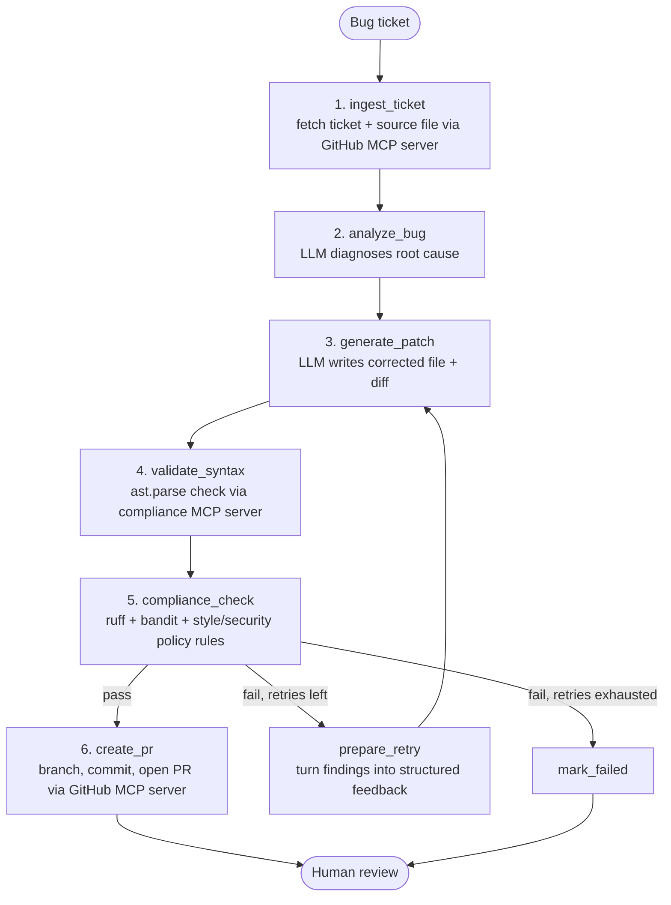

# Autonomous Code Remediation & Compliance Agent

A stateful multi-agent system that autonomously ingests bug tickets from a
GitHub repository, analyzes and patches the affected code, validates and
audits the patch against enterprise security/style policy, self-corrects on
failure, and opens a pull request once the patch is clean.

**Stack:** Python · LangGraph · FastMCP · MCP SDK · GitHub API · Groq / Anthropic LLMs · Docker · Git

**Status:** verified working end-to-end against a real GitHub repo — see [PR #3](https://github.com/rohansingh1008/Autonomous-Code-Remediation-Compliance-Agent/pull/3) for a live example run.

---

## Workflow

The agent runs as a single LangGraph `StateGraph`. Two agents operate inside
it: a **fixer** (analyzes the ticket and writes the patch) and an **auditor**
(an isolated compliance agent that only reads code and returns findings — it
never touches GitHub). A feedback loop lets the fixer self-correct against
the auditor's findings before anything is proposed to a human.



### Step by step

| # | Node | What happens |
|---|------|---------------|
| 1 | `ingest_ticket` | Pulls the next open bug ticket (a `bug`-labeled GitHub issue, or a local ticket in demo mode) and fetches the source file it points to via the **GitHub MCP server**. |
| 2 | `analyze_bug` | The LLM is given the ticket text and the file, and returns a short root-cause diagnosis — no fix yet, diagnosis only. |
| 3 | `generate_patch` | The LLM rewrites the file to fix the diagnosed bug. A unified diff is generated for review. |
| 4 | `validate_syntax` | The patch is sent to the **isolated compliance MCP server**, which parses it with `ast.parse` to catch syntax regressions before anything else runs. |
| 5 | `compliance_check` | The same server runs static analysis (`ruff`, `bandit`) plus declarative style/security rules from `config/policies.yaml` (no hardcoded secrets, no `eval`/`exec`, no bare `except`, etc.). |
| 6a | `create_pr` (on pass) | The GitHub MCP server creates a branch, commits the patch, and opens a PR with the diagnosis, diff, and compliance summary in the description. Reuses an existing branch/PR instead of failing if one already exists for this ticket. |
| 6b | `prepare_retry` (on fail, retries remain) | Syntax errors and policy violations are compiled into structured feedback and routed back to `generate_patch`, which retries with that feedback in context (default cap: 3 attempts). |
| 6c | `mark_failed` (on fail, retries exhausted) | The run stops and reports what still fails, for a human to pick up. |

**Why two MCP servers instead of one:** separating the "fixer's" GitHub write
access from the "auditor's" read-only compliance checks means the agent that
proposes a change is never the sole judge of whether it's safe to ship —
mirroring a real separation-of-duties review setup.

---

## Project layout

```
autonomous-code-remediation-agent/
├── main.py                      # CLI entrypoint
├── agent/
│   ├── graph.py                 # LangGraph workflow + self-correction loop
│   ├── state.py                 # shared state schema
│   ├── llm.py                   # Groq / Anthropic clients + offline MockLLM
│   └── mcp_clients.py           # sync wrapper for calling the two MCP servers
├── mcp_servers/
│   ├── github_server.py         # GitHub tools (real API or local git sim)
│   └── compliance_server.py     # isolated syntax/style/security auditor
├── config/
│   └── policies.yaml            # style + security rules
├── demo_repo/                   # sample repo + ticket for the offline demo
│   ├── app/calculator.py
│   └── tickets/ticket_001.json
├── tests/test_smoke.py
├── Dockerfile
├── docker-compose.yml
├── requirements.txt
└── .env.example
```

---

## Run it (offline demo, zero setup)

```bash
cd autonomous-code-remediation-agent
python -m venv venv && source venv/bin/activate   # optional but recommended
pip install -r requirements.txt

python main.py
```

With no LLM API key set, the agent uses a deterministic offline `MockLLM`
that knows how to fix the bundled demo bug (a `ZeroDivisionError` in
`demo_repo/app/calculator.py`), so the full workflow above runs end to end
with zero credentials. Inspect the result with:

```bash
git -C demo_repo log --oneline
cat pr_output/agent_fix-1.md
```

### Run the tests

```bash
pytest tests/ -v
```

### Run with Docker

```bash
cp .env.example .env
docker compose up --build
```

---

## Run it for real (a live GitHub repo + Groq or Claude)

1. Copy `.env.example` to `.env` and fill in:
   ```
   GROQ_API_KEY=gsk_...                # or ANTHROPIC_API_KEY=sk-ant-...
   GITHUB_TOKEN=github_pat_...         # fine-grained token, scoped to your repo
   GITHUB_REPO=your-username/your-repo
   ```
   `.env` is loaded automatically by both `main.py` and `mcp_servers/github_server.py`
   (the GitHub MCP server runs as a separate subprocess, so it loads `.env` itself
   rather than relying on inheriting the parent process's environment).

2. **Token permissions** (fine-grained token): `Contents: Read and write`,
   `Issues: Read-only`, `Pull requests: Read and write`, `Metadata: Read-only`
   (auto-required). Scope repository access to the specific repo you're testing.

3. Open a GitHub issue with the `bug` label. To target a specific file
   (rather than letting the agent guess the first `.py` file it finds), start
   the issue body with a `File:` line:
   ```
   File: demo_repo/app/calculator.py

   Calling divide(10, 0) crashes with an unhandled ZeroDivisionError.
   It should raise a ValueError instead of crashing.
   ```

4. `pip install -r requirements.txt`
5. `python main.py` (or `python main.py --ticket-id <issue-number>` for a specific one)

The agent reads the real issue, pulls the real file via the Contents API,
patches it with Groq/Claude, audits it, and opens a real branch + PR against
`main` for human review. It does not auto-merge.

**Windows note:** if you hit a `'charmap' codec can't encode character ...`
error, it's a Windows console-encoding issue, not a logic bug — the project's
file I/O is already forced to UTF-8 to avoid this; make sure you're on the
latest version of `mcp_servers/github_server.py`.

---

## What I'd extend first

1. **Richer context for the fixer** — search the repo for files referencing
   symbols in the ticket (grep/embeddings), not just one file by hint.
2. **Multi-file patches** — model `patched_code` as a list of `{path, content}`
   so fixes spanning several files work in one pass.
3. **Persistent MCP sessions** — `mcp_clients.py` spawns a fresh subprocess
   per tool call; a long-lived session per run would be faster.
4. **Real test execution** — run the repo's actual test suite inside Docker
   against the patch, not just `ast.parse`, and feed failures into the retry loop.
5. **Human-in-the-loop gate** — a LangGraph interrupt before `create_pr` for
   high-risk paths (e.g. `auth/`, `payments/`), configurable in `policies.yaml`.
6. **Semantic compliance pass** — an LLM-based check in `compliance_server.py`
   for things regex can't catch, run only after the cheap regex pass clears.
7. **Structured tracing** — log each node transition (ticket, retry count,
   verdict) to build a dashboard of what the agent has fixed vs. failed on.
